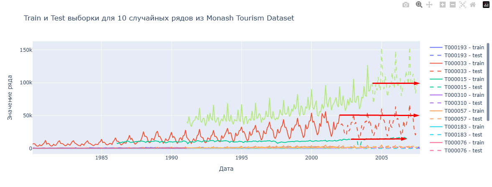
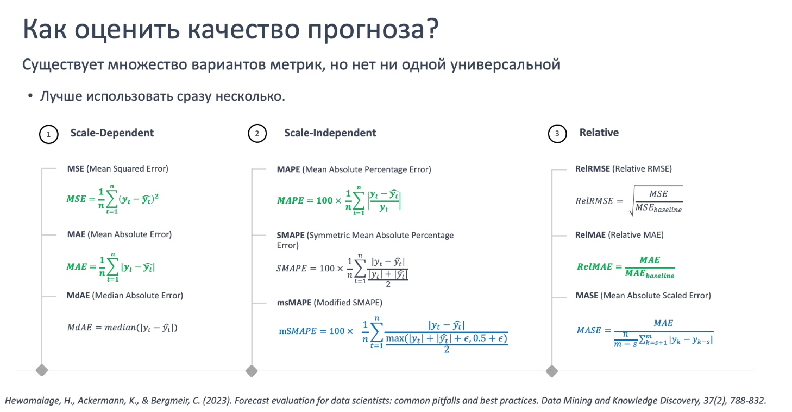
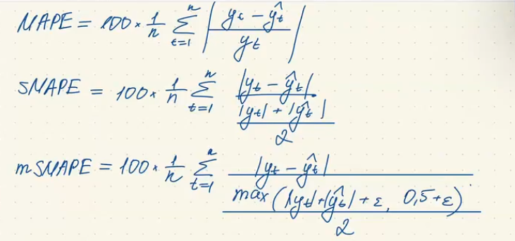
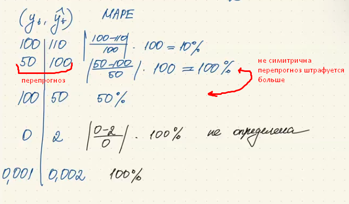
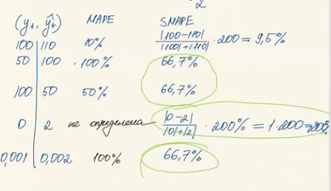
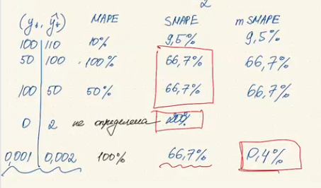

# Временные ряды | Методы декомпозиции рядов (24.11.2025)
Условно у нас есть вот такой временной ряд

|   | id      | lag_1   | lag_12 | month | year | day | dayofweek |
|---:|---|---|---:|---:|---:|---:|---:|
| 0 | T000000 | NaN | NaN | 1 | 1979 | 31 | 3 |
| 1 | T000000 | 1149.87 | NaN | 2 | 1979 | 28 | 3 |
| 2 | T000000 | 1053.80 | NaN | 3 | 1979 | 31 | 5 |
| ... | ... | ... | ... | ... | ... | ... | ... |

Вот таким образом мы можем его разделить на трейн-тест


```python
train_ts, test_ts = [], []
for ts_id in df["id"].unique():
    ts_data = df[df["id"] == ts_id].sort_values("timestamp")
    split_index = int(len(ts_data) * 0.8)
    train_ts.append(ts_data.iloc[:split_index])
    test_ts.append(ts_data.iloc[split_index:])
    
train_df = pd.concat(train_ts).reset_index(drop=True)
test_df = pd.concat(test_ts).reset_index(drop=True)
```




Какие метрики подойдут для решения задачи в которой мы прогнозируем несколько временных рядов ? 

- Все кроме scale dependent





Метрика smape ограничена 200% и там где mape не определена, smape упирается в границу

Smape симметрична, но проблему с маленькими значениями не решается





mSmape решает проблему с маленькими значениями

Дальше разбираем stl разложение временного ряда на компоненты

