# Временные ряды | Методы декомпозиции рядов (24.11.2025)
Условно у нас есть вот такой временной ряд

|   | id      | lag_1   | lag_12 | month | year | day | dayofweek |
|---:|---|---|---:|---:|---:|---:|---:|
| 0 | T000000 | NaN | NaN | 1 | 1979 | 31 | 3 |
| 1 | T000000 | 1149.87 | NaN | 2 | 1979 | 28 | 3 |
| 2 | T000000 | 1053.80 | NaN | 3 | 1979 | 31 | 5 |
| ... | ... | ... | ... | ... | ... | ... | ... |

Вот таким образом мы можем его разделить на трейн-тест


```python
train_ts, test_ts = [], []
for ts_id in df["id"].unique():
    ts_data = df[df["id"] == ts_id].sort_values("timestamp")
    split_index = int(len(ts_data) * 0.8)
    train_ts.append(ts_data.iloc[:split_index])
    test_ts.append(ts_data.iloc[split_index:])
    
train_df = pd.concat(train_ts).reset_index(drop=True)
test_df = pd.concat(test_ts).reset_index(drop=True)
```
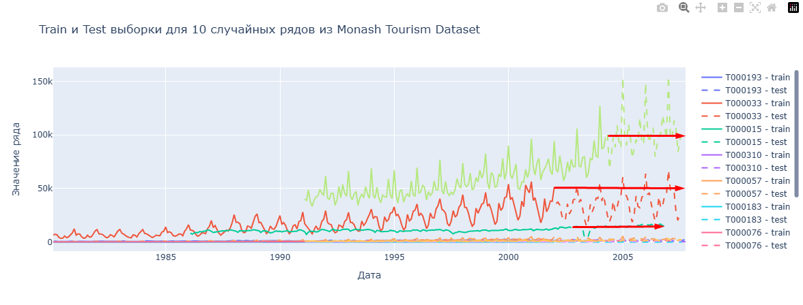

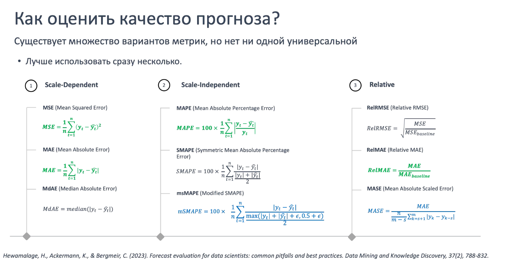

Какие метрики подойдут для решения задачи в которой мы прогнозируем несколько временных рядов ? 

- Все кроме scale dependent

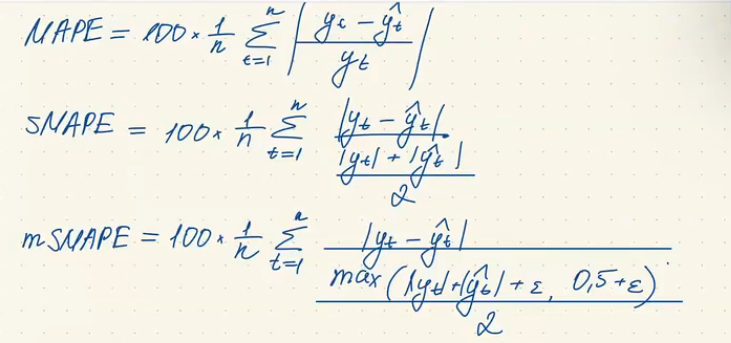

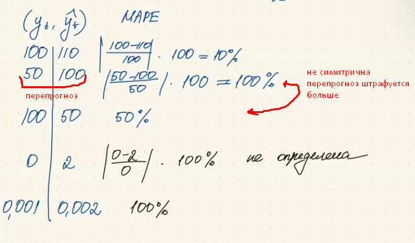

Метрика smape ограничена 200% и там где mape не определена, smape упирается в границу

Smape симметрична, но проблему с маленькими значениями не решается

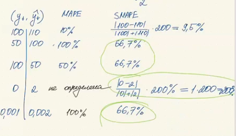

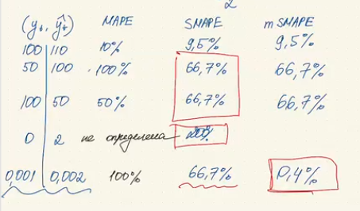

mSmape решает проблему с маленькими значениями

Дальше разбираем stl разложение временного ряда на компоненты

Что нам нужно чтобы понять как работает stl разложение

- Нужно понять как устроен loess

- Нужно понимание ядровых функций

- МНК

В общем случае loess сглаживание это когда мы хотим для каждой точки найти какое то средневзвешенное значение её соседей и для этого нам нужно определить какой вес каждый сосед должен вносить в среднее, это определяется тем на сколько мы далеко от него находимся 

Основная идея (простыми словами)
Представьте, что у вас есть облако точек (например, продажи по дням с большим шумом). Вы хотите провести через него плавную линию тренда.

Классическая глобальная регрессия (например, полиномиальная) пытается найти одну кривую, которая наилучшим образом описывает все данные сразу. Это плохо работает для сложных, нелинейных паттернов.

LOESS делает иначе:

Выбираете конкретную точку на оси X (например, день 15).

Смотрите не на все данные, а только на точки, которые находятся рядом с днём 15 (в пределах "окна").

В этом маленьком локальном окне строите простую модель (обычно полином 1-й или 2-й степени), которая лучше всего описывает только эти соседние точки. Причём точки внутри окна имеют разный вес: чем ближе к целевому дню 15, тем больше их вес при расчёте.

По построенной локальной модели предсказываете значение сглаженной линии именно для дня 15.

Последовательно повторяете шаги 1-4 для каждой точки на оси X. В итоге вы получаете сглаженное значение для всех точек, "прошивая" их вместе из множества локальных регрессий.

Как это работает технически (по шагам)
1. Выбор параметров:

α (alpha, или span) — самый важный параметр. Это доля точек от общего их числа, которые будут попадать в каждое локальное окно.

α = 0.5 означает, что для расчёта значения в точке X будут использоваться 50% ближайших к ней данных.

Чем больше α, тем шире окно и гладче (но, возможно, менее детально) будет результат.

Чем меньше α, тем окно уже, и результат точнее следует за данными (но может "ловить" шум).

λ (lambda, степень полинома) — обычно 1 (линейная регрессия) или 2 (квадратичная). λ = 1 используется чаще и более устойчива.

2. Алгоритм для одной целевой точки x₀:

Определяем окно: Находим k = α * N ближайших соседей к точке x₀ (где N — общее число точек).

Присваиваем веса каждой точке i внутри окна с помощью трикубической весовой функции:
w_i = (1 - (|x_i - x₀| / d)³ )³, если |x_i - x₀| < d, иначе 0.
Здесь d — расстояние до самого дальнего соседа в окне.

Что это даёт? Вес плавно уменьшается от 1 (в точке x₀) до 0 (на границе окна). Выбросы на краю окна почти не влияют на расчёт.

Строим взвешенную регрессию: Методом наименьших квадратов находим параметры локальной модели (полинома степени λ), минимизируя взвешенную сумму квадратов ошибок: Σ w_i * (y_i - ŷ_i)².

Предсказываем значение: Подставляем x₀ в полученную локальную модель. Результат — это сглаженное значение ŷ₀ для точки x₀.

3. Повторяем шаг 2 для каждой точки, для которой мы хотим получить сглаженное значение.

Преимущества LOESS

Гибкость (Непараметричность): Не нужно заранее предполагать вид функции (линейная, экспоненциальная и т.д.). Линия принимает любую форму, которую диктуют локальные данные.

Устойчивость к выбросам: Благодаря трикубическим весам, влияние далёких точек (потенциальных выбросов) сильно снижается.

️ Интуитивность: Всего два основных параметра (α и λ), которые легко интерпретировать.

Адаптивность: Хорошо работает с данными, где степень "извилистости" тренда меняется в разных областях.

Сравнение с другими методами

Скользящее среднее (Moving Average): LOESS — это его умный "родственник". Вместо простого среднего, LOESS использует взвешенную регрессию, что делает его более точным и гибким.

Сплайны (Splines): Сплайны также гибки, но они глобально оптимизируют гладкость всей кривой сразу. LOESS более "локален" и интуитивен в настройке. Сплайны лучше подходят для интерполяции, LOESS — для сглаживания зашумленных данных.

Ядерное сглаживание (Kernel Smoothing): Очень похожая философия, но в ядерном сглаживании чаще используется простое взвешенное среднее, а не регрессия. LOESS с полиномом 0-й степени — это и есть ядерное сглаживание.

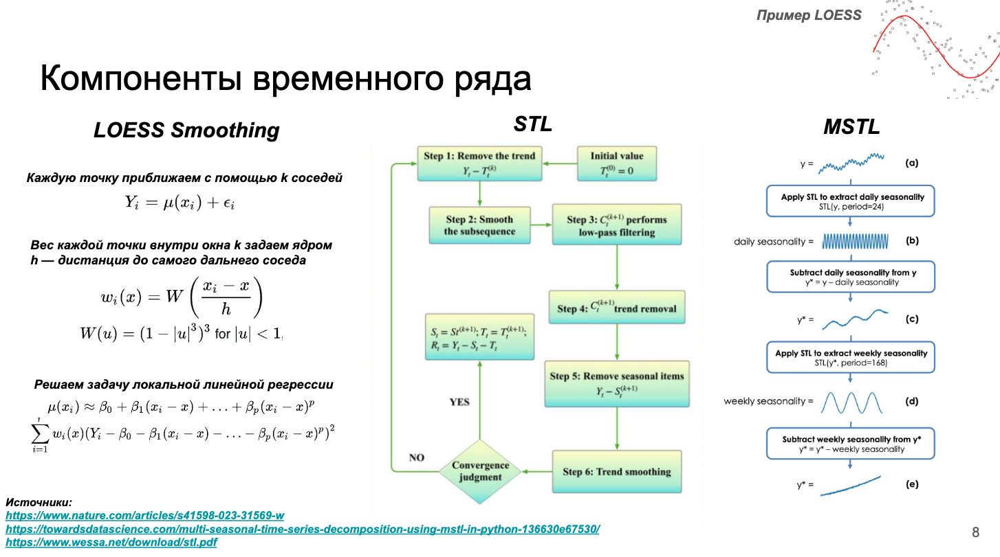

А вот код 

```python
def loess_1d_for_regular_ts(
    y: np.ndarray, num_local_points: int = 7, degree: int = 1
) -> np.ndarray:
    """
    Версия LOESS для одномерного регулярного временного ряда.

    Аргументы:
        y — массив точек
        num_local_points — количество соседей для локального окна
            должно быть нечетным числом
        degree — степень локальной аппроксимации:
            1 — локальная прямая,
            0 — локальная константа
    """
    assert num_local_points % 2 == 1, "num_local_points должно быть нечетным"

    y_length = len(y)

    # y_smooth — пустой массив под сглаженные значения
    y_smooth = np.empty(y_length, dtype=float)

    # Для каждой точки из y нужно найти значение, которое пойдет в y_smooth
    for i in range(y_length):
        # Находим локальное окно вокруг точки x[i]
        # Если точка краевая, то окно будет обрезано
        left = max(0, i - num_local_points // 2)
        right = min(y_length, i + num_local_points // 2 + 1)

        y_local = y[left:right]
        current_num_local_points = len(y_local)

        # Находим расстояния и веса точек в локальном окне
        distances = np.abs(np.arange(left, right) - i)
        u = distances / (np.max(distances) + 1e-8)
        weights = (1 - u**3) ** 3

        # Решаем задачу локальной регрессии
        if degree == 0:  # model: y ~ \beta_0.
            X = np.ones((current_num_local_points, 1))
            X0 = np.array([[1]])
        else:  # model: y ~ \beta_0 + \beta_1 (j - i).
            assert current_num_local_points >= 2, "Для degree=1 нужно минимум 2 точки"
            X = np.vstack([np.ones(current_num_local_points), np.arange(left, right) - i]).T
            X0 = np.array([[1, 0]])

        W = np.diag(weights)
        XtW = X.T @ W
        beta = np.linalg.pinv(XtW @ X) @ XtW @ y_local  # \beta = (X^T W X)^{-1} X^T W y.

        y_smooth[i] = (X0 @ beta).item()

    return y_smooth

y = np.array([1.0, 2.0, 4.0, 3.0, 1.0])
y_smooth = loess_1d_for_regular_ts(y, num_local_points=5, degree=1)
print(y_smooth)

seed_everything()

# Сгенерируем синтетический временной ряд
n = 200
t = np.arange(n)
trend_true = 0.02 * t
season_true = 2 * np.sin(2 * np.pi * t / 24)
noise = np.random.normal(scale=0.7, size=n)
y = trend_true + season_true + noise

# Сглаживание с разными размерами окна
y_smooth_7 = loess_1d_for_regular_ts(y, num_local_points=7, degree=1)
y_smooth_21 = loess_1d_for_regular_ts(y, num_local_points=21, degree=1)

plt.figure(figsize=(12, 6))

plt.plot(t, y, label="Исходный ряд", alpha=0.5)

plt.plot(t, y_smooth_7, label="LOESS, окно=7", linewidth=2)
plt.plot(t, y_smooth_21, label="LOESS, окно=21", linewidth=2)

plt.title("LOESS-сглаживание регулярного временного ряда")
plt.xlabel("t")
plt.ylabel("y")
plt.legend()
plt.grid(True)
plt.tight_layout()
plt.show()
```

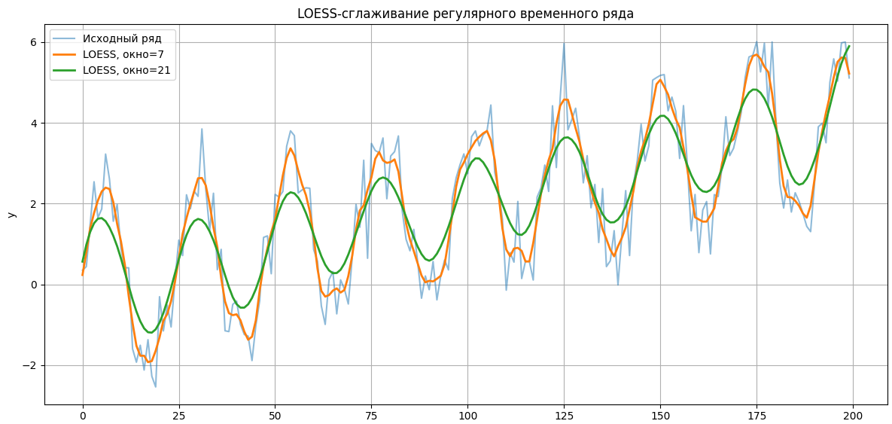

```python
# Теперь собираем функции для сглаживания тренда и сезонности.

def estimate_trend_loess(y: np.ndarray, num_local_points: int = 7, degree: int = 1) -> np.ndarray:
    """Сглаживаем тренд"""
    trend = loess_1d_for_regular_ts(y, num_local_points=num_local_points, degree=degree)
    return trend


def lowpass_loess(y: np.ndarray, num_local_points: int, degree: int = 1) -> np.ndarray:
    """lowpass фильтр - делаем все тоже самое что и с трендом, но берём намного бОльшее окно"""    
    return loess_1d_for_regular_ts(y, num_local_points=num_local_points, degree=degree)


def estimate_seasonal_loess(
    y_detrended: np.ndarray, period: int, num_local_points: int = 7, degree: int = 1
) -> np.ndarray:
    """сезонная loess фиксируем период сезонности"""
    n = len(y_detrended)
    # для помесячных данных period = 12
    seasonal = np.zeros(n, dtype=float)

    # Для каждой фазы сезона (0, 1, ..., period-1) берем подпоследовательность и сглаживаем ее
    # собираем все ферали, все марты и тд 
    # и применяем к этим групкам loess
    for phase in range(period):
        idx = np.arange(phase, n, period)
        y_sub = y_detrended[idx]
        y_sub_smooth = loess_1d_for_regular_ts(
            y_sub, num_local_points=num_local_points, degree=degree
        )

        seasonal[idx] += y_sub_smooth

    return seasonal

# Наконец, собираем STL пайплайн.
def stl_decompose(
    y: np.ndarray,
    period: int,
    seasonal_num_local_points: int = 7,
    trend_num_local_points: int = 7,
    n_iter: int = 2,
    seasonal_degree: int = 1,
    trend_degree: int = 1,
    lowpass_num_local_points: int | None = None,
) -> tuple[np.ndarray, np.ndarray, np.ndarray]:
    """
    Step 1: Remove the trend          -> y_detrended = y - T^(k)
    Step 2: Smooth the subsequence    -> S_raw_t
    Step 3: Low-pass filtering        -> C_t = lowpass(S_raw_t)
    Step 4: Trend removal             -> S_t = S_raw_t - C_t
    Step 5: Remove seasonal items     -> y_deseasonal = y - S_t
    Step 6: Trend smoothing           -> T^(k+1)_t
    """
    y = np.asarray(y, dtype=float)
    n = len(y)

    if lowpass_num_local_points is None:
        lowpass_num_local_points = max(7, 3 * period)
        if lowpass_num_local_points % 2 == 0:
            lowpass_num_local_points += 1

    # Инициализация: тренд = 0, сезонность = 0
    trend = np.zeros(n, dtype=float)
    seasonal = np.zeros(n, dtype=float)

    for _ in range(n_iter):
        # Step 1: Remove the trend          -> y_detrended = y - T^(k)
        y_detrended = y - trend
        
        # Step 2: Smooth the subsequence    -> S_raw_t
        seasonal_raw = estimate_seasonal_loess(
            y_detrended,
            period=period,
            num_local_points=seasonal_num_local_points,
            degree=seasonal_degree,
        )
        
        # Step 3: Low-pass filtering        -> C_t = lowpass(S_raw_t)
        seasonal_lowpassed = lowpass_loess(
            seasonal_raw, num_local_points=lowpass_num_local_points, degree=seasonal_degree
        )
        
        # Step 4: Trend removal             -> S_t = S_raw_t - C_t
        seasonal = seasonal_raw - seasonal_lowpassed

        # Step 5: Remove seasonal items     -> y_deseasonal = y - S_t
        y_deseasonal = y - seasonal
        
        # Step 6: Trend smoothing           -> T^(k+1)_t
        trend = estimate_trend_loess(
            y_deseasonal, num_local_points=trend_num_local_points, degree=trend_degree
        )

    # Остаток
    remainder = y - trend - seasonal

    return trend, seasonal, remainder

seed_everything()

PERIOD = 12
y = random_train_df["target"].to_numpy()
t = random_train_df.index.to_numpy()

# STL-разложение
trend_num_local_points = int(1.5 * PERIOD / (1 - 1.5 / PERIOD)) + 1

trend, seasonal, remainder = stl_decompose(
    y,
    period=12,
    seasonal_num_local_points=25,
    trend_num_local_points=trend_num_local_points,
    n_iter=10,
    seasonal_degree=1,
    trend_degree=1,
    lowpass_num_local_points=None,
)

# Визуализация
fig, axes = plt.subplots(4, 1, figsize=(10, 8), sharex=True)

axes[0].plot(t, y)
axes[0].set_title("Исходный ряд y_t")

axes[1].plot(t, trend)
axes[1].set_title("Тренд T_t (LOESS)")

axes[2].plot(t, seasonal)
axes[2].set_title("Сезонность S_t")

axes[3].plot(t, remainder)
axes[3].set_title("Остаток R_t")

plt.tight_layout()
plt.show()    
```

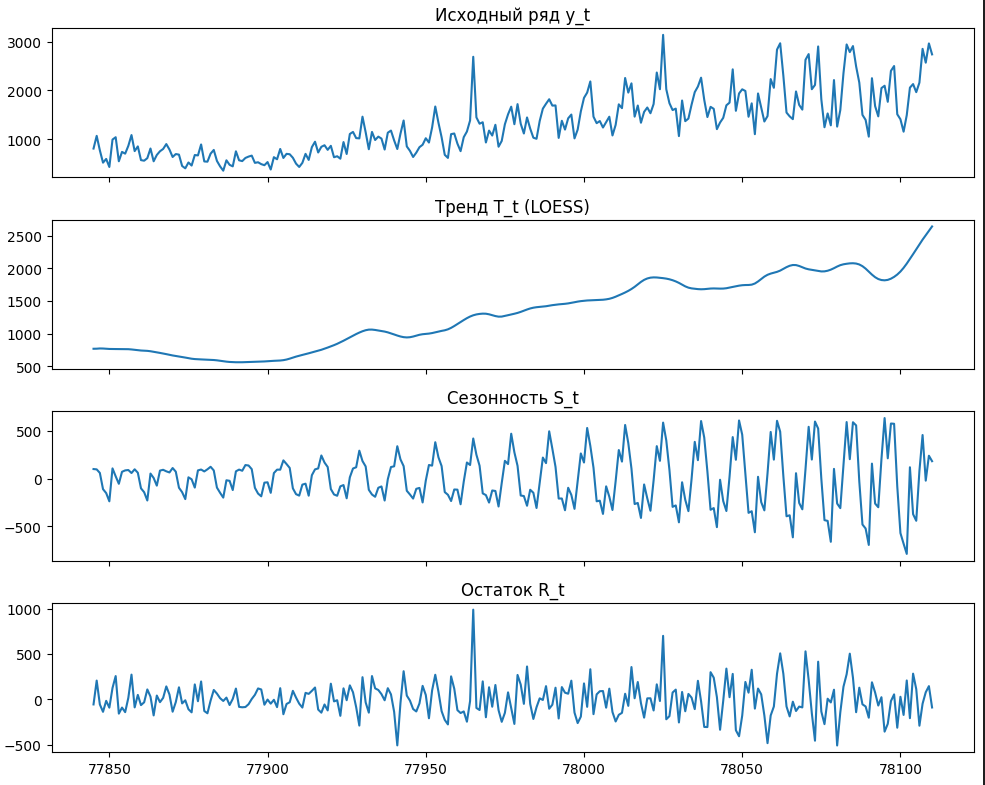

Вот параметры stl statsmodels

```python
class statsmodels.tsa.seasonal.STL(
    endog, 
    period=None, # период сезонности для того чтобы составлять пачки точек
    seasonal=7, # длина окна для сезонного сглаживания
    trend=None, # длина окна тренда
    low_pass=None, # low pass фильтр
    seasonal_deg=1, # степени сглаживания (нужно ли нам находить оценку b1 в регрессии или можно ограничиться только b0) это влияет на то на сколько наша кривая гладкая при заданном количестве соседей
    trend_deg=1, # степени сглаживания
    low_pass_deg=1, # степени сглаживания
    robust=False, 
    seasonal_jump=1, 
    trend_jump=1, 
    low_pass_jump=1
    )
```
```text
seasonal_degint, optional
Degree of seasonal LOESS. 0 (constant) or 1 (constant and trend).

trend_degint, optional
Degree of trend LOESS. 0 (constant) or 1 (constant and trend).

low_pass_degint, optional
Degree of low pass LOESS. 0 (constant) or 1 (constant and trend).
```

Что вообще с этим делать и зачем оно нужно

Самое просто что мы можем сделать - накинуть простые модели на тренд, сезонность и накинуть сложную модель на остаток

```text
STL-разложение можно использовать для того, чтобы затем строит пайплайны моделей на основое получившихся компонент.

Так, можно тренд и сезонность предсказать простыми моделями, а затем результаты сложить. Остатки можно приблизить ARMA-моделью.

Попробуем сделать первую часть, а именно: построим прогноз тренда методом простого экспоненциального сглаживания, сезонность – наивным повторением последнего цикла, а итоговый прогноз будем считать как сумму тренда и сезонности.
```

Вот пример прогнозирования по компонентам

```python
HORIZON = len(random_test_df)

# Генерируем индекс для прогноза
freq = pd.infer_freq(random_train_df["timestamp"])
start = pd.to_datetime(random_train_df["timestamp"].values[-1]) + pd.tseries.frequencies.to_offset(
    freq
)
forecast_index = pd.date_range(start=start, periods=HORIZON, freq=freq)

# Прогноз тренда методом простого экспоненциального сглаживания
trend = res.trend.dropna()
model_trend = SimpleExpSmoothing(trend.to_numpy()).fit()
trend_fc = model_trend.forecast(HORIZON)

# Наивный сезонный прогноз
seasonal = res.seasonal
last_season = seasonal.iloc[-PERIOD:]
seasonal_vals = np.tile(last_season.values, int(np.ceil(HORIZON / PERIOD)))[:HORIZON]
seasonal_fc = pd.Series(seasonal_vals, index=forecast_index)

# Суммируем компоненты и собираем итоговый прогноз
forecast_df = pd.DataFrame({"trend": trend_fc, "seasonal": seasonal_fc})
forecast_df["forecast"] = forecast_df["trend"] + forecast_df["seasonal"]
```
# ETS-модели экспоненциального сглаживания
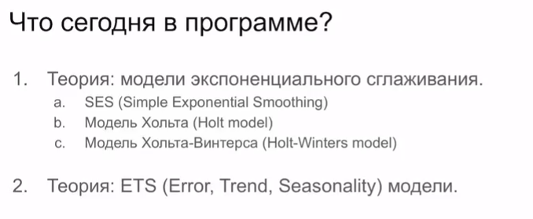


_SES (Simple exponential smoothing)_

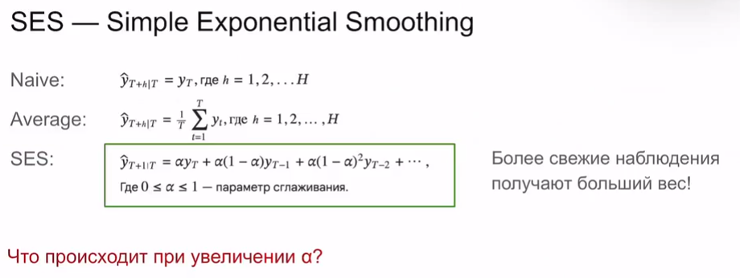

более полная формула

$S_t = \alpha \displaystyle\sum_{k=0}^{\infty} (1 - \alpha)^ky_{t-k}$

Чем больше альфа тем меньший вес мы отдаем более старым значением

при увеличении α:

- множитель (1−α) становится меньше;
- веса старых наблюдений убывают быстрее;
- прогноз сильнее зависит от последних данных.

При α=0.2

| Наблюдение |    Вес |
| ---------- | -----: |
| (y_t)      |   0.20 |
| (y_{t-1})  |   0.16 |
| (y_{t-2})  |  0.128 |
| (y_{t-3})  | 0.1024 |

Старые наблюдения сохраняют заметное влияние.

При α=0.8

| Наблюдение |    Вес |
| ---------- | -----: |
| (y_t)      |   0.80 |
| (y_{t-1})  |   0.16 |
| (y_{t-2})  |  0.032 |
| (y_{t-3})  | 0.0064 |

Здесь уже после двух-трех шагов назад вклад становится практически нулевым.


Интуитивно

- Большая α (например, 0.8–0.9) — модель быстро реагирует на изменения, но прогноз становится более «шумным».

- Маленькая α (например, 0.1–0.2) — модель сильнее сглаживает ряд, но медленнее реагирует на изменения.

Именно поэтому коэффициент α называют параметром сглаживания: он определяет, насколько сильно модель доверяет новым наблюдениям по сравнению с накопленной историей.

Получается если \alpha = 1, то прогноз становится наивным, если \alpha очень маленькое то прогноз становится средним

Почему SES даёт горизонтальный плоский прогноз

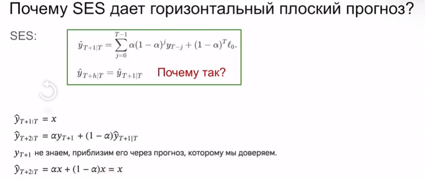

Получается, что каждый последующий прогноз будет равняться первому полученному

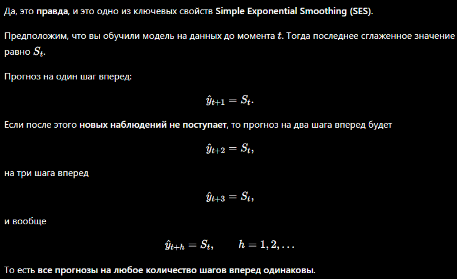

_Модель Хольта (Holt Model)_

# Временные ряды | Модели ARIMA и SARIMAX (01.12.2025)

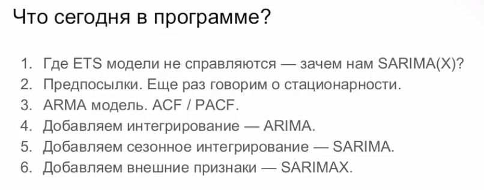

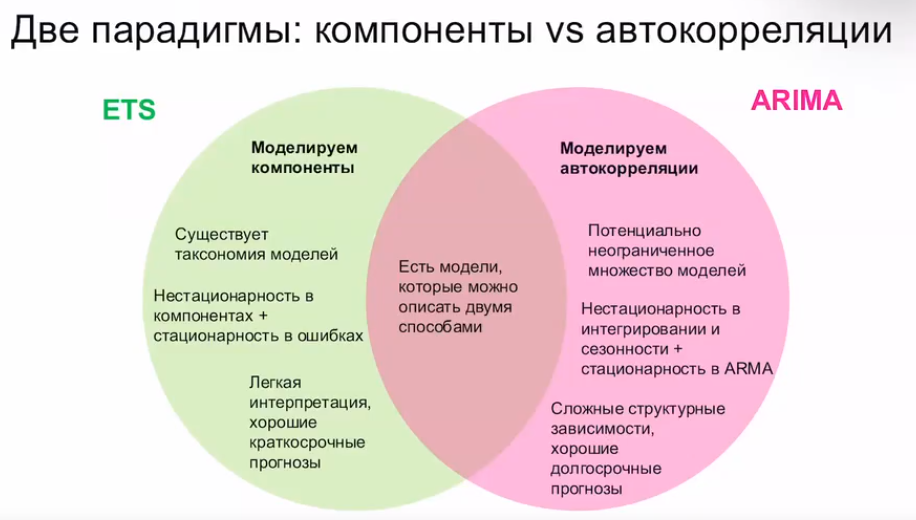

ets - моделирует компоненты

arima - моделируем зависимость между наблюдениями во времени

базовая arima - I - приводим к стационарности удаляя тренд и остальное приближаем моделью arma

что такое автокорреляция ?

Отличный и очень важный вопрос, особенно для работы с временными рядами! Автокорреляция — это, буквально, "корреляция самого с собой, но со сдвигом во времени".

Простая суть на примере
Представьте температуру воздуха.

- Сегодняшняя температура сильно зависит от вчерашней. Если вчера было +25°C, маловероятно, что сегодня ударит мороз -10°C.

- С температурой позавчерашнего дня зависимость тоже есть, но уже чуть слабее.

- С температурой годичной давности зависимость почти исчезла (сезонность не в счёт — это отдельный эффект).

Эта статистическая зависимость значений одного ряда от его собственных предыдущих значений и называется автокорреляцией.

Формальное определение:

Автокорреляция измеряет линейную связь между наблюдениями одного временного ряда xt и теми же наблюдениями, сдвинутыми на k шагов во времени xt−k

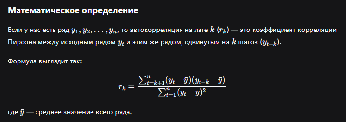

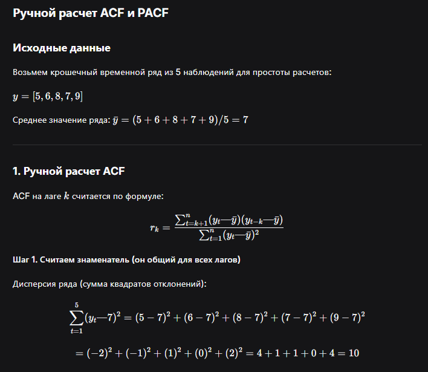

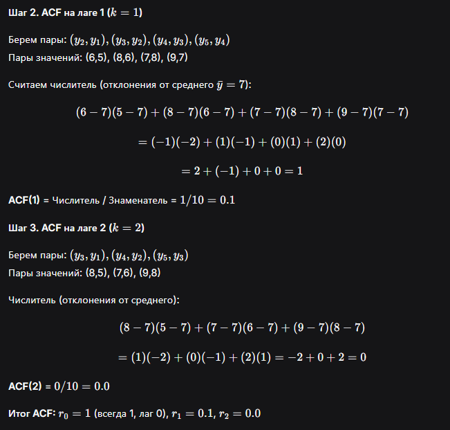

__Расчет в Python__


```python
import numpy as np
import pandas as pd
import statsmodels.api as sm
from statsmodels.tsa.stattools import acf, pacf
import matplotlib.pyplot as plt

# Наши данные
y = [5, 6, 8, 7, 9]

# 1. Расчет ACF в Python
# Параметр nlags=4, чтобы увидеть лаги с 0 по 4 (хотя у нас данных мало)
acf_values = acf(y, nlags=4, fft=False)  # fft=False для точного расчета (не быстрого преобразования Фурье)
print("ACF значения (лаг 0-4):", acf_values)

# 2. Расчет PACF в Python
# Метод 'ols' (Ordinary Least Squares) - использует регрессию
pacf_values = pacf(y, nlags=4, method='ols')
print("PACF значения (лаг 0-4):", pacf_values)
```
```text
ACF значения (лаг 0-4): [1.    0.1   0.   -0.25 -0.3 ]
PACF значения (лаг 0-4): [1.    0.1  -0.125 0.   -0.   ]
```

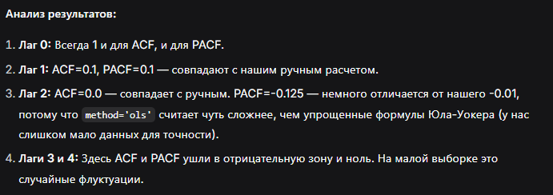

1. Почему классическая ACF "слепа" к нелинейностям?

Классическая ACF, которую мы считали выше — это корреляция Пирсона. Она измеряет только линейную зависимость.

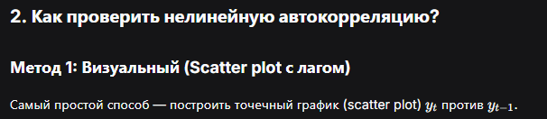

```python
import numpy as np
import pandas as pd
import matplotlib.pyplot as plt
import statsmodels.api as sm
from scipy import stats

# Сгенерируем два примера: линейный и нелинейный
np.random.seed(42)
n = 300

# 1. Линейный процесс AR(1)
y_linear = [0]
for i in range(1, n):
    y_linear.append(0.7 * y_linear[-1] + np.random.normal(0, 1))

# 2. Нелинейный процесс (квадратичный)
y_nonlinear = [0]
errors = np.random.normal(0, 0.5, n)
for i in range(1, n):
    # y_t = 0.3 * (y_{t-1})^2 + e_t
    y_nonlinear.append(0.3 * y_nonlinear[-1]**2 + errors[i])

# Превращаем в массивы pandas для удобства
df = pd.DataFrame({
    'linear': y_linear,
    'nonlinear': y_nonlinear
})

# Строим scatter plots
fig, axes = plt.subplots(2, 2, figsize=(12, 10))

# Лаг 1 для линейного процесса
axes[0, 0].scatter(df['linear'].shift(1), df['linear'], alpha=0.5)
axes[0, 0].set_title(f'Линейный процесс: Лаг 1\nКорреляция Пирсона: {df["linear"].corr(df["linear"].shift(1)):.3f}')
axes[0, 0].set_xlabel('y_{t-1}')
axes[0, 0].set_ylabel('y_t')

# Лаг 1 для нелинейного процесса
axes[0, 1].scatter(df['nonlinear'].shift(1), df['nonlinear'], alpha=0.5)
pearson_corr = df['nonlinear'].corr(df['nonlinear'].shift(1))
axes[0, 1].set_title(f'Нелинейный процесс: Лаг 1\nКорреляция Пирсона: {pearson_corr:.3f}')
axes[0, 1].set_xlabel('y_{t-1}')
axes[0, 1].set_ylabel('y_t')

# Добавим линию регрессии (чтобы показать, что она плохо ложится)
from scipy import stats

# Для нелинейного - покажем, что линия не подходит
x = df['nonlinear'].shift(1).dropna()
y = df['nonlinear'][1:]
z = np.polyfit(x, y, 1)
p = np.poly1d(z)
axes[0, 1].plot(x.sort_values(), p(x.sort_values()), "r--", alpha=0.8, label='Линейная подгонка')

# Добавим квадратичную подгонку для сравнения
z2 = np.polyfit(x, y, 2)
p2 = np.poly1d(z2)
axes[0, 1].plot(x.sort_values(), p2(x.sort_values()), "g-", alpha=0.8, label='Квадратичная подгонка')
axes[0, 1].legend()

plt.tight_layout()
plt.show()
```


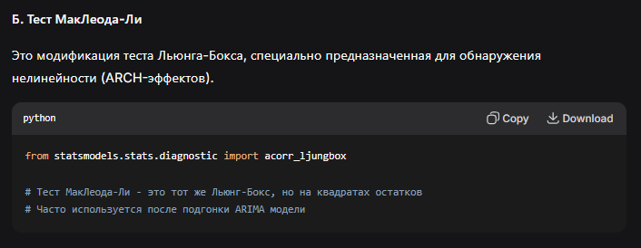

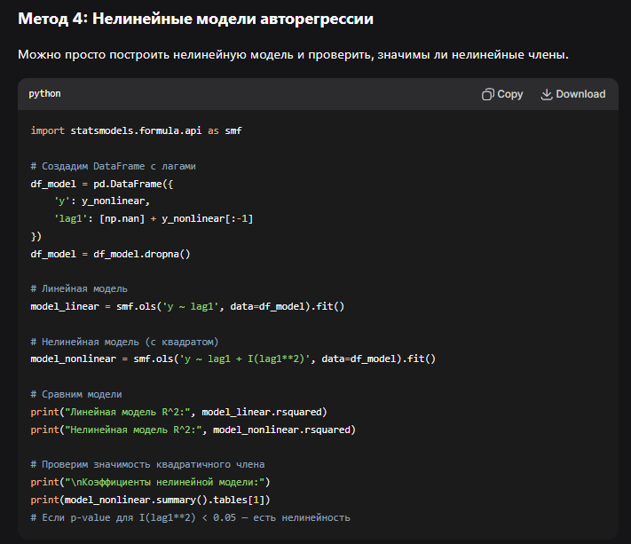

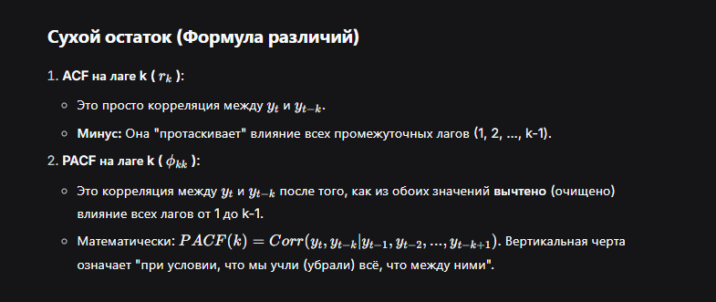

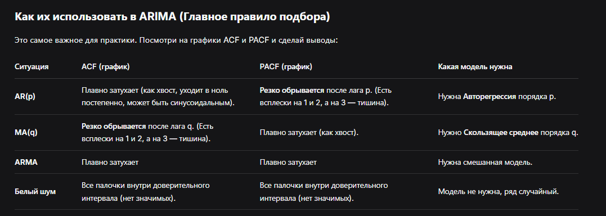

SARIMA 

S - пытаемся очистить ряд от сезонности

I - интеграция, пытаемся очистить ряд от тренда

Оставшийся ряд мы считаем стационарный и пытаемся его приближать с помощью модели ARMA

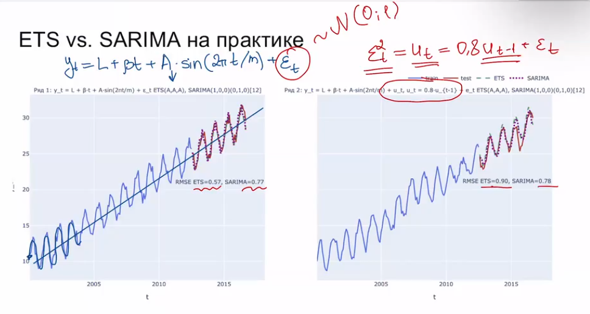

Выше приведен пример двух рядов

Слева обычный временной ряд 

L - некоторый уровень ряда (первая точка с которого он начинается)

betat - тренда

A * sin - сезонность

et - ошибка из нормального распределения

Справа помимо прочего в ошибку добавлена автокорреляция

Arima лучше справляется с рядом в котором в остатках есть автокорреляция

Почему так происходит?

Потому что arima модели как раз направлены на моделирование автокорреляций в значении ряда и в остатках

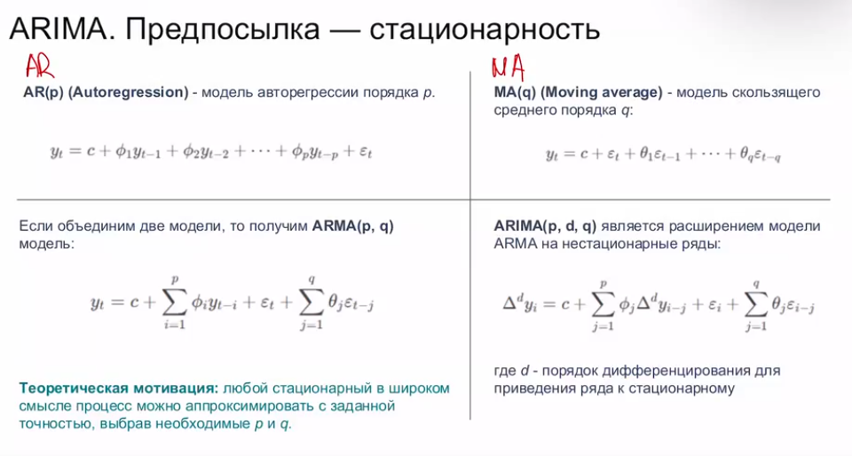

Модели ARIMA состоят из двух частей AR - авторегрессионная часть и MA часть

AR - по сути это просто линейное выражение значения yt через его предыдущие p значений

MA - это попытка через наши ошибки на прошлых значениях прогнозирования выразить текущее значение

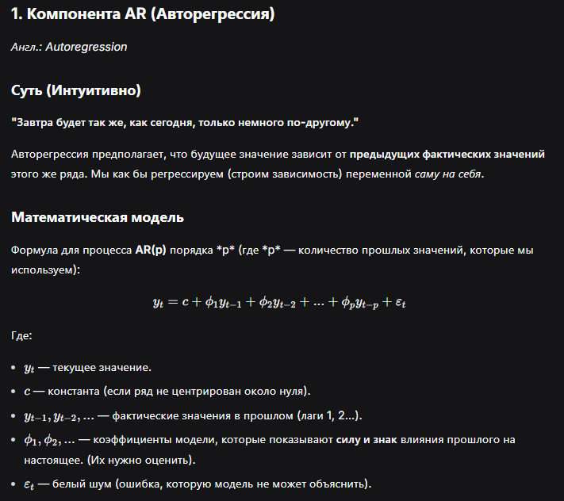

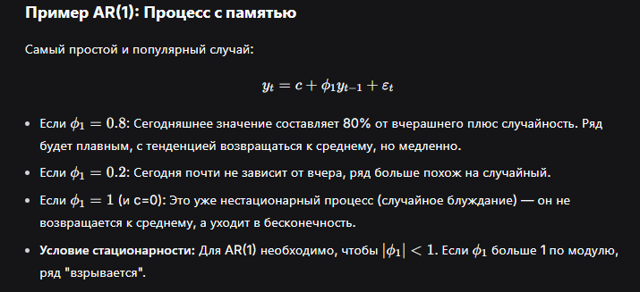

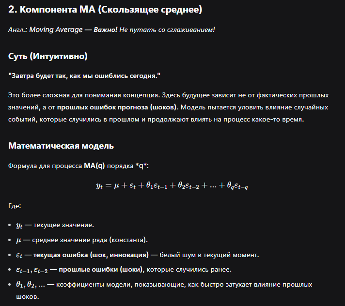

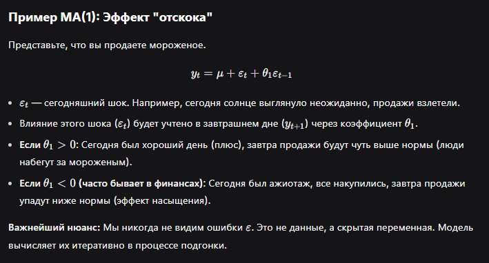


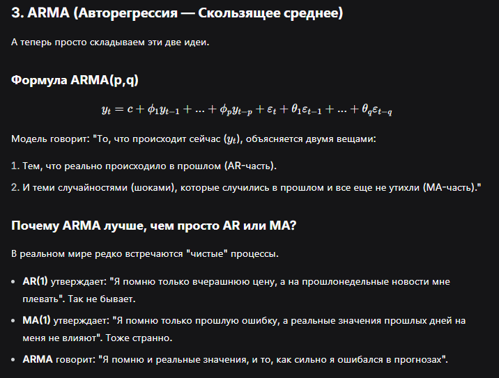

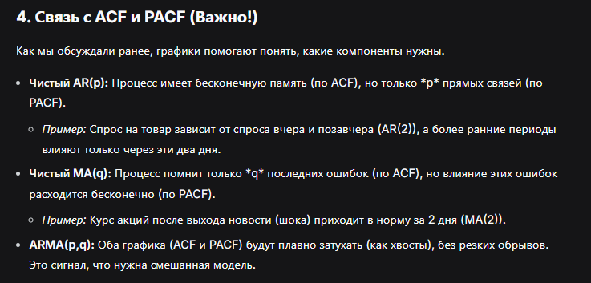


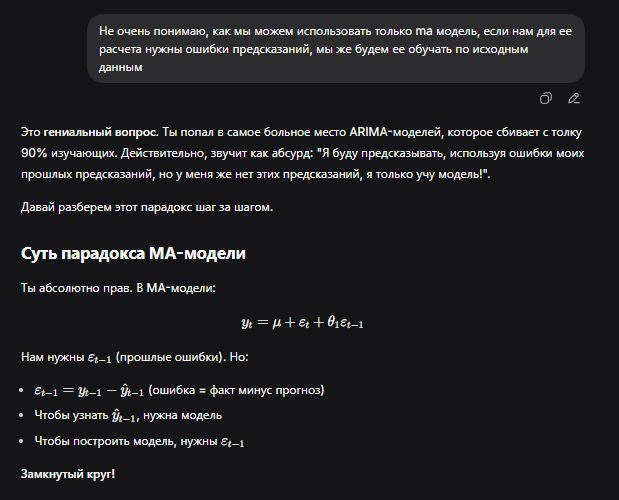

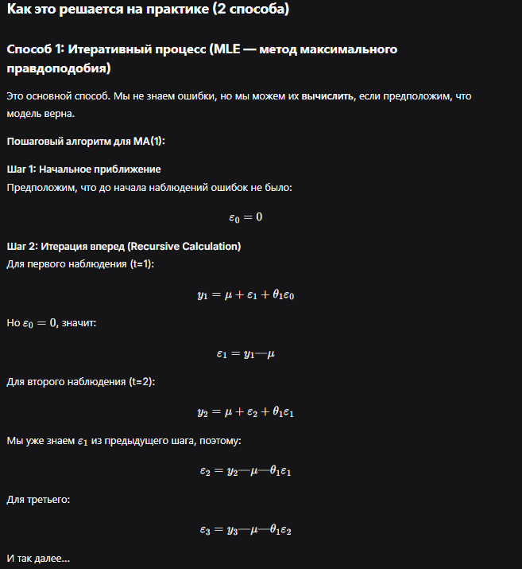

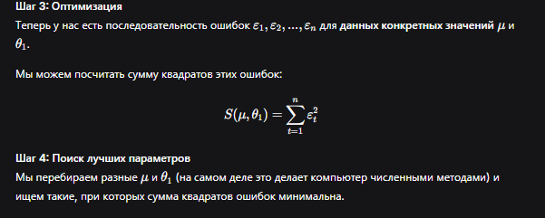

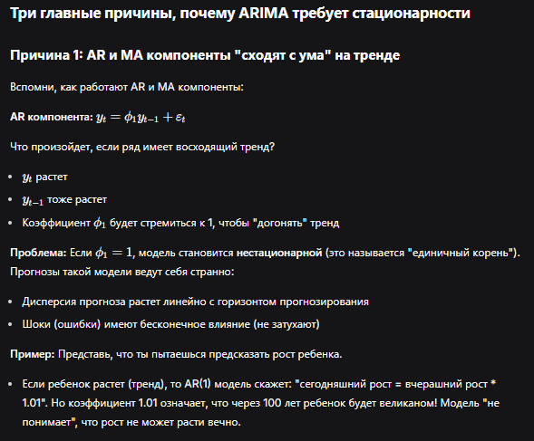


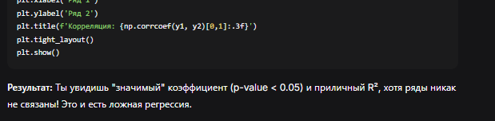

Почему вообще arima модели считаются такими классными

Теоретическая мотивация - Теорема Вольда

Которая нам говорит, что любой стационарный в широкм смысле процесс, мы можем аппроксимировать с заранее заданной точностью, при условии, что мы не ограничены в выборе того, какого порядка у нас p и q


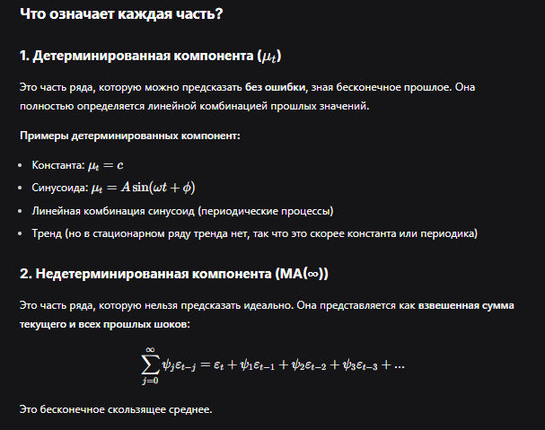

Параметры pdq

p - то на сколько далеко смотрит AR часть

d - порядок дифференчирования

q - на сколько далеко смотрит MA часть

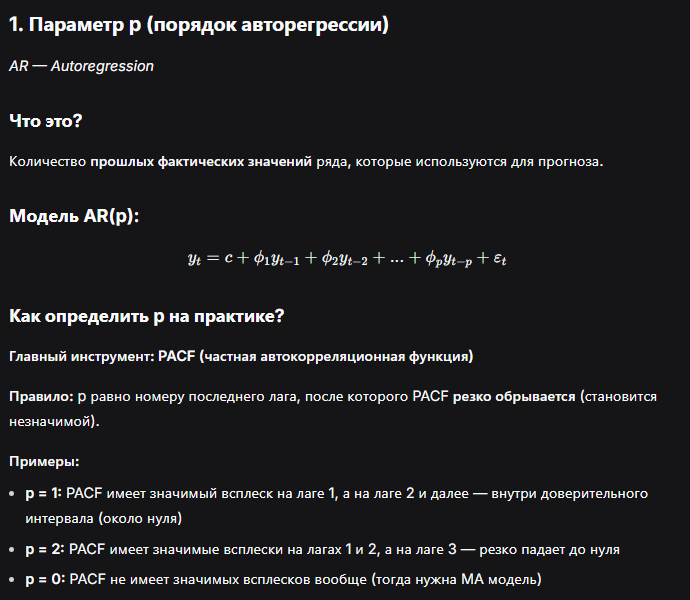

Это логично, так как нам нужно взять первые несколько линейно зависимых лагов

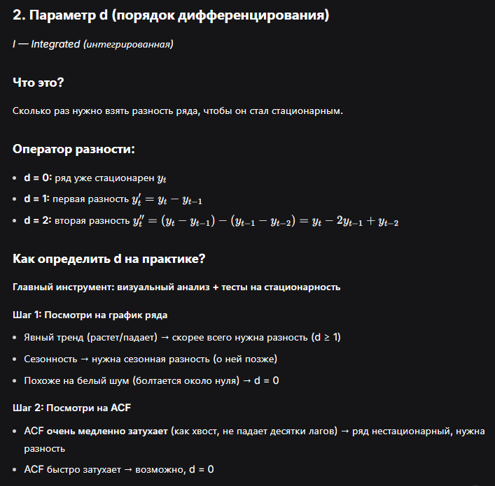

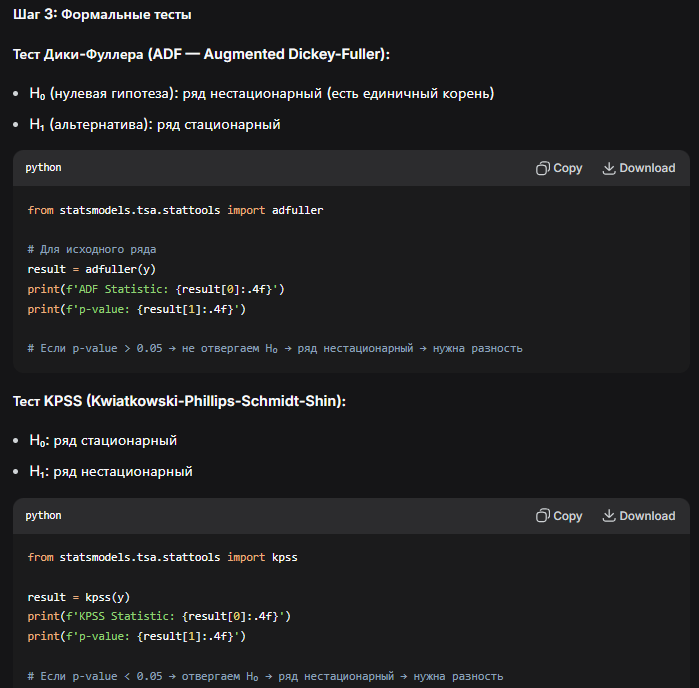

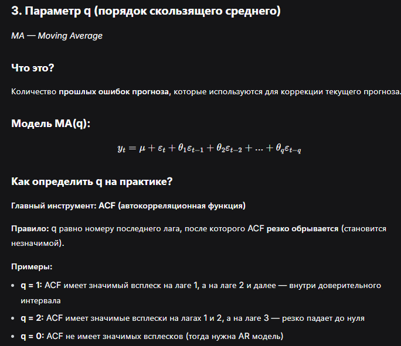


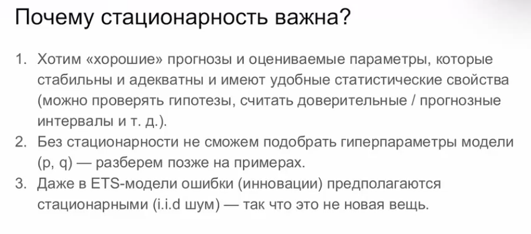


